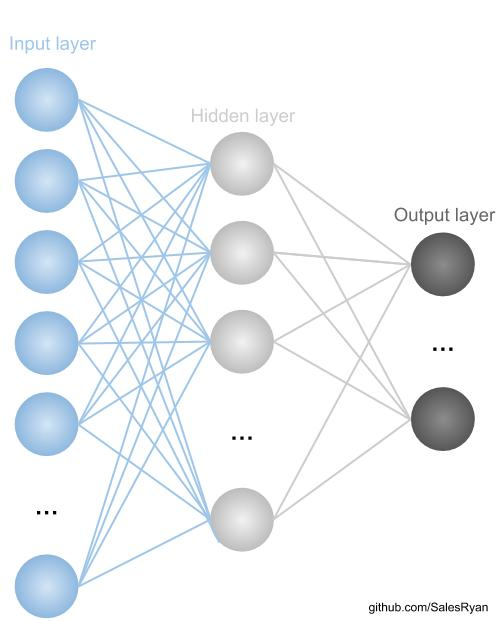

<p align="center">
  
</p>

# Neural-Network-Mnist-Dataset
Repository dedicated to the classification of the minist database using neural networks programmed in python, only with the numpy library.

## Requirements
- [Python3](https://www.python.org/downloads/release/python-382/) 
- *numpy*
```bash
pip install numpy
```
- *progressbar*
```bash
pip install progressbar
```
- *keras*
```bash
pip install Keras
```
- *sklearn*
```bash
pip install sklearn
```

## Installation

Clone this repository:

```bash
https://github.com/SalesRyan/Neural-Network-MNIST-Dataset.git
```

## Implementation

### [Dataset](https://www.tensorflow.org/datasets/catalog/mnist)

The MNIST Data set is usually used to measure the efficiency of an algorithm in classifying images, so it was chosen to be the data set to be classified.

<p>
  
</p>


## Matrix Functions

The cells presented in this section are responsible for operations between matrices and scales.

## MPL Implementation

In this Section we have the implementation of the artificial neural network, with its functions, with emphasis on feedforward and backpropagation.

<p>
  
</p>

## Training

The snippet of training code is very simple, only all training sets are shown to the network.

## Prediction

The training code snippet happens the prediction of the test set, based on the training previously obtained.

## Validation

The validation is composed by the metrics of accuracy recall that are usually used for validation of predictions.

- [*Accuracy*](https://scikit-learn.org/stable/modules/generated/sklearn.metrics.accuracy_score.html)
- [*Recall*](https://scikit-learn.org/stable/modules/generated/sklearn.metrics.recall_score.html)

## Conclusion

The artificial neural network implemented in python only with the library numpy obtained a result of Accuracy: 0.9398 and Recal: 0.9400592307897068 for the MNITS dataset.


## Training view

visualize the adjustment of weights during training. I programmed an interface with pygame, to facilitate visualization it was necessary to use a character resizing algorithm, I chose PCA (Principal Component Snalysis).
You can check it out below.
Run MLP.py.


## About me

Graduation in Information Systems at the Federal University of Piauí, Possibility of experience with developing solutions in the area of Digital Image Processing, Computer Vision and Artificial Intelligence. I currently participate in research projects in the area of Vision and Computational Intelligence.

- [*LinkedIn*](https://www.linkedin.com/in/ryan-sales-2b10141a6/)
- [*Lattes*](http://lattes.cnpq.br/6944781068896428)
- [*Instagram*](https://www.instagram.com/sales.ryann/?hl=pt-br)